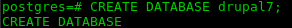
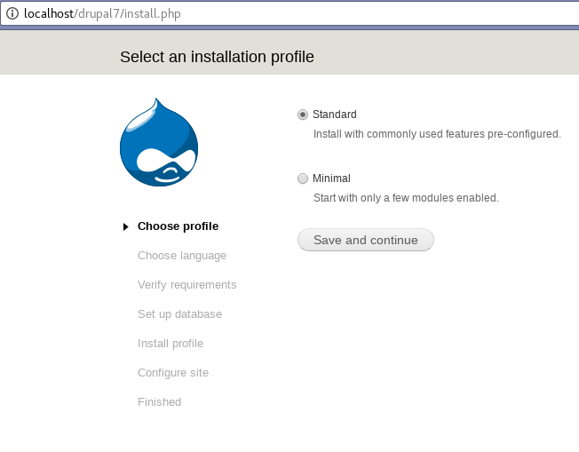
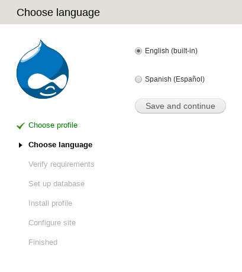
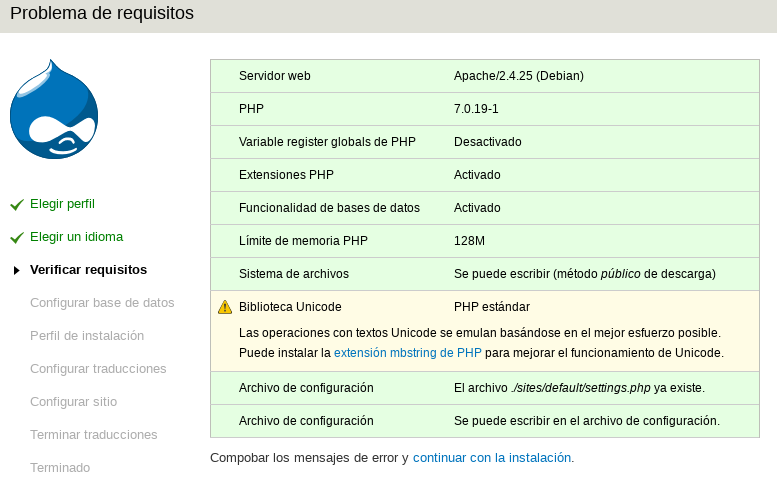
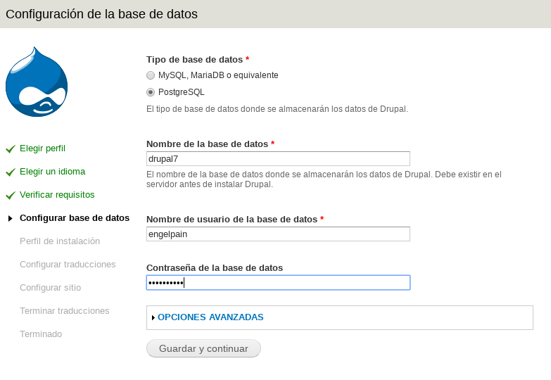
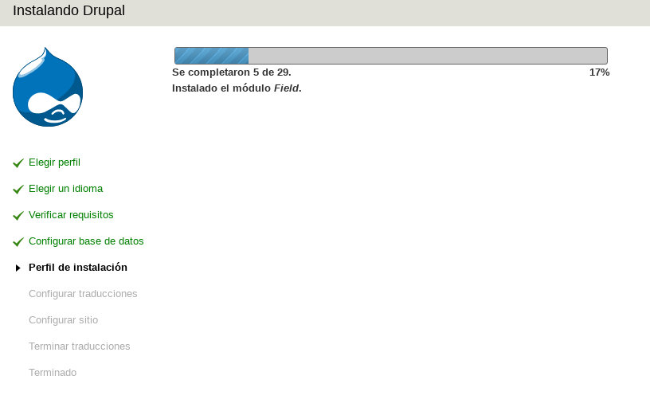
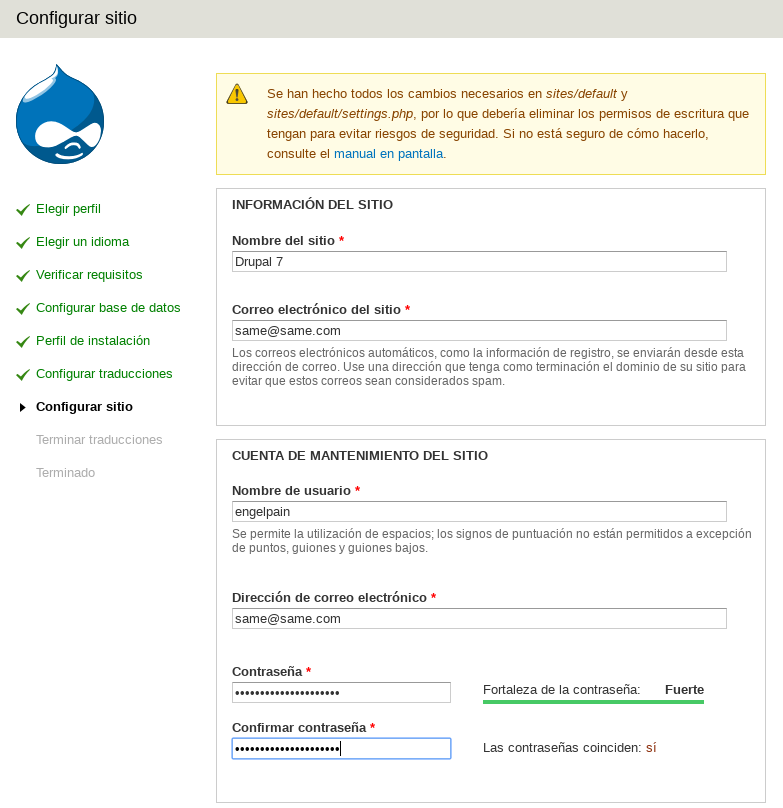
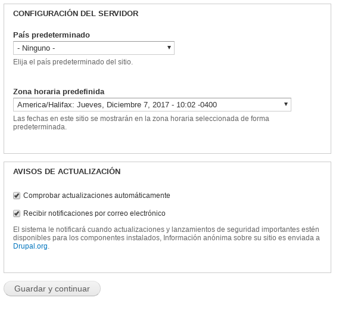
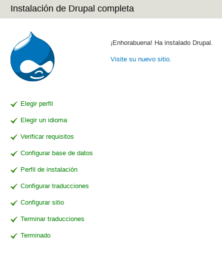
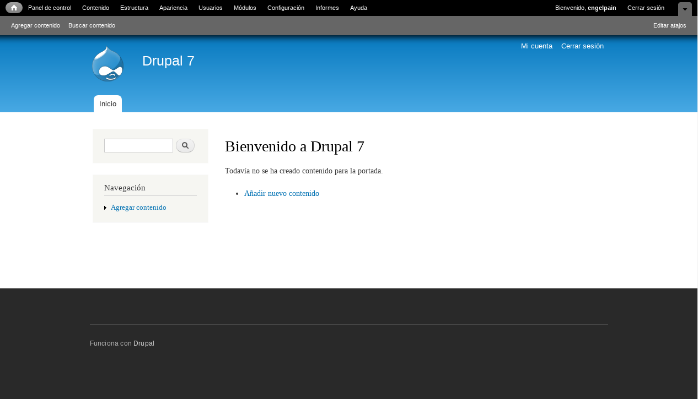

<h1> Guía de instalación de Drupal 7.x </h1>

 Centro Nacional de Desarrollo e Investigación de Tecnologías Libres (CENDITEL)

 <a href="https://www.cenditel.gob.ve/">CENDITEL</a>, Mérida - Venezuela 

 Dirección de Desarrollo 

 Autor: <a href="https://twitter.com/Engel_PAIN">Ing. Angelo Osorio</a> 

 Fecha de Elaboración: 01-09-2017 (dd,mm,aaaa)
 

<h2>Notas del Autor</h2>

 Drupal es un CMS creado bajo licencia GNU/GPL escrito en PHP, lo que lo hace portable para cualquier sistema operativo (sea Linux, Windows o Mac) que disponga de un navegador web, y requiere PHP, un Servidor local y MariaDB/MySQL o PostgreSQL para su instalación.

<b>Importante:</b> Dado que esta instalación se realizó en Debian 9, se harán muchos de los pasos desde la consola (Like a Boss). No significa que no se pueda realizar sin la consola, también se puede realizar desde el gestor de archivos de su preferencia.

<b>Nota:</b> Drupal trabaja bajo la directiva DTC, significa: Don't Touch the Core Drupal posee directorios donde se deben ingresar los módulos externos y los temas, sin embargo, los directorios donde se deben ingresar no son los primeros que se encuentran al abrir el core de Drupal, sino los que hay dentro de los directorios específicos para ellos dentro de <code> sites/all </code>

El símbolo al principio de una línea de comandos indica:

 <code>  $ = hacer la sentencia como usuario </code> 

 <code>  # = hacer la sentencia como administrador</code> 

<h3>Requisitos previos para la instalación de Drupal 7.x</h3>
<ul>
  <li> Apache, nginx o cualquier servidor que admita PHP </li>
  <li> Php5.3 o superior, Php7 </li>
  <li> MariaDB/MySQL o PostgreSQL </li>
  <li> Navegador Web</li>
</ul>

<h3>Equipo del tutorial:</h3>
<ul>
  <li> Debian 9.2 Stretch </li>
  <li> PHP 7.0.19-1 </li>
  <li> Postgresql 9.6.4 </li>
  <li> Apache 2.4.25 </li>
</ul>

<h2> Instalacion Drupal 7.x </h2>
<ol>
  <li>
    
 Para realizar la instalación de Drupal primero hay que descargar su núcleo desde el navegador, desde su <a href="https://ftp.drupal.org/files/projects/drupal-7.56.zip"> página oficial</a> para obtener la versión más actualizada de Drupal 7 (Enlace obtenido el 01-09-2017).
    

  </li>
  <li>
    
 Luego de descargar el núcleo hay de descomprimir el archivo que anteriormente se descargó en el directorio del servidor, en este caso la carpeta <code>var/www/html</code>
    

  </li>
  <li>
    
 Se le puede dar un nombre arbitrario a la carpeta que se descomprimió, para este ejemplo se le llamará <strong>drupal7</strong> al directorio para mayor comprensión de la información.
    

  </li>
  <li>
    
 Para realizar la instalación en español, hay de descargar el <a href="http://ftp.drupal.org/files/translations/7.x/drupal/drupal-7.56.es.po">paquete de traducciones</a>, en el directorio <code>drupal7/profiles/standard/translations/</code>
    

  </li>
  <li>
    
 Desde la consola, se entrará a la carpeta sites/default dentro del sistema usando en comando:
    

    
 <code> $ cd /var/www/html/drupal7/sites/default</code> 

    
<b>Nota:</b> la ruta puede variar dependiendo del servidor, la versión y/o el sistema operativo

  </li>
  <li>
    
 Realizar una copia del archivo <code> default.settings.php </code> con el nombre <code> settings.php </code> que será el que guarde todos los datos de configuración de Drupal, con el comando:
    

    
<code> $ cp default.settings.php settings.php </code>

  </li>
  <li>
    
 Dentro de la misma carpeta se debe crear el directorio <code>files</code> para el correcto comportamiento de Drupal en la posterior instalación:
    

    
<code> $ mkdir files </code>

  </li>
  <li>
    
 Ahora hay que cambiarle los permisos al archivo y el directorio para que pueda ser reescrito en la instalación

    
<code> # chmod 777 settings.php </code>

    
<code> # chmod 777 -R files </code>

  </li>
  <li>
    
 Crear una base de datos en PostgreSQL o MySQL, con un nombre cualquiera, para este ejemplo se creará una base de datos en PostgreSQL con el nombre de <strong> drupal7 </strong>
    

    

  </li>
  <li>
    
Desde un navegador web se debe ingresar al directorio del proyecto escribiendo en la barra de URL <code> localhost/drupal7 </code> Automáticamente comenzará la instalación de Drupal 7 mostrando la siguiente pantalla en el navegador:
    

    

      
    

    
 La instalación seleccionada por defecto es la <b>Standard</b>, ahora hay que hacer click en el botón <b>Save and continue</b>   
    

  </li>
  <li>
    
 La siguiente página muestra el selector de lenguaje, si se descargó el paquete de traducciones de español (mostrado en el paso 4) se permitirá realizar la instalación en Español, caso contrario, únicamente aparecerá Inglés como opción.
    

    
  

    
Seleccionar Spanish (Español) y click en <b>Save and continue</b> 

  </li>
  <li>
    
 La página posterior es la de verificación de requisitos: 

    
  

    
 Si se realizaron con veracidad los pasos anteriores, no debería mostrar ningún problema, y sólo se debe hacer click en <b>continuar con la instalación</b>
    

  </li>
  <li>
    
Se procede a configurar los datos de la base de datos.

    

    
En este caso la base de datos se creó en PostgreSQL, entonces se selecciona la opción homónima

    
En el campo <b>Nombre de la base de datos</b> se debe escribir el nombre de la base de datos que se creó para el proyecto, en este caso <b>drupal7</b>

    
Posteriormente se deben introducir los del usuario que tiene permisos de acceso para esa base de datos

    
Finalizando este apartado dando click en el botón <b>Guardar y continuar</b>

  </li>
  <li>
    
A continuación comenzará la instalación automática de Drupal 7

    

  </li>
  <li>
    
Configurar el sitio en la siguiente pantalla:

    

    
Escribiendo en el campo <b>Nombre del sitio</b> el nombre que tendrá el proyecto, en este caso <b>Drupal 7</b>

    
Lo demás son datos administrativos

    

    
Para terminar la instalación hay que hacer click en <b>Guardar y continuar</b>

  </li>
  <li>
    
También se debe modificar de nuevo los permisos del archivo settings.php (del paso 8) a sólo lectura, desde la consola utilizando el comando:

    
<code> # chmod 444 settings.php </code>

  </li>
  <li>
    
Terminado el paso anterior se mostrará un mensaje avisando que se terminó la instalación:

    

    
Aquí únicamente hay que hacer click en <b>Visite su nuevo sitio</b> para visualizar la instalación terminada 

    

  </li>
</ol>